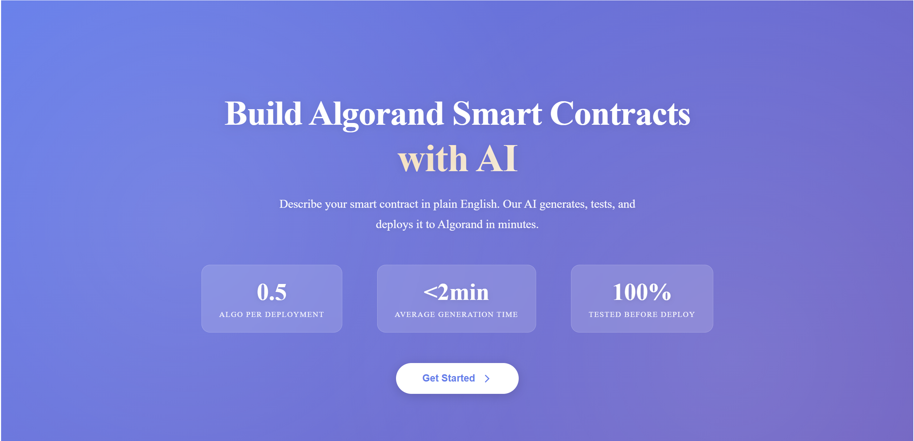
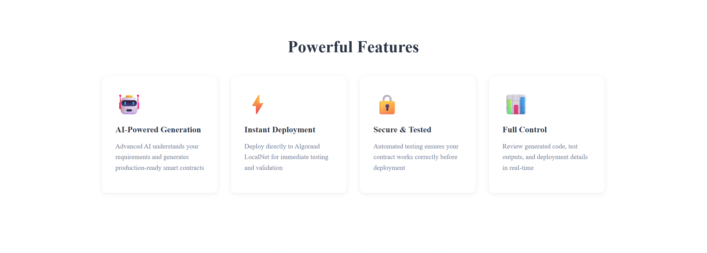
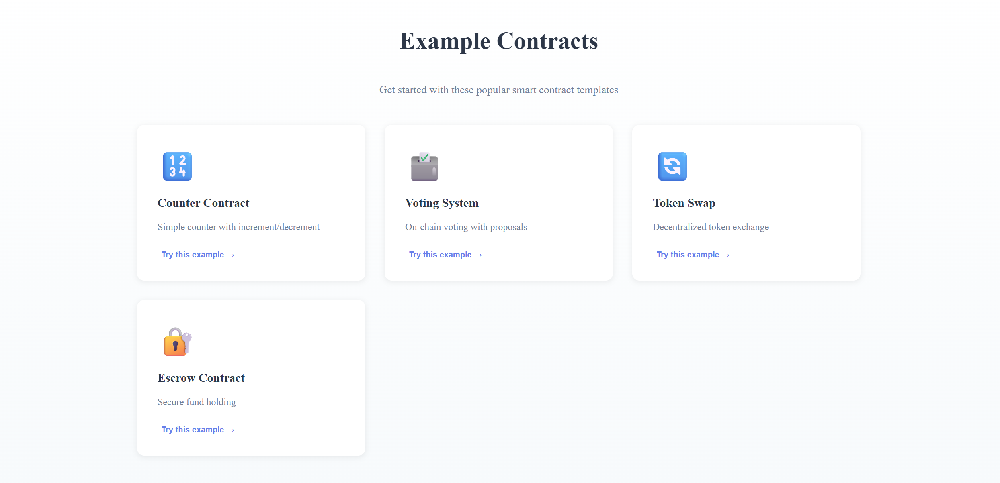
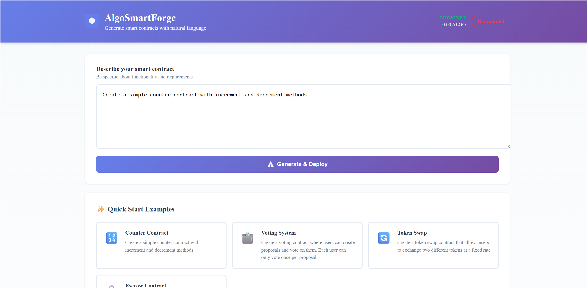
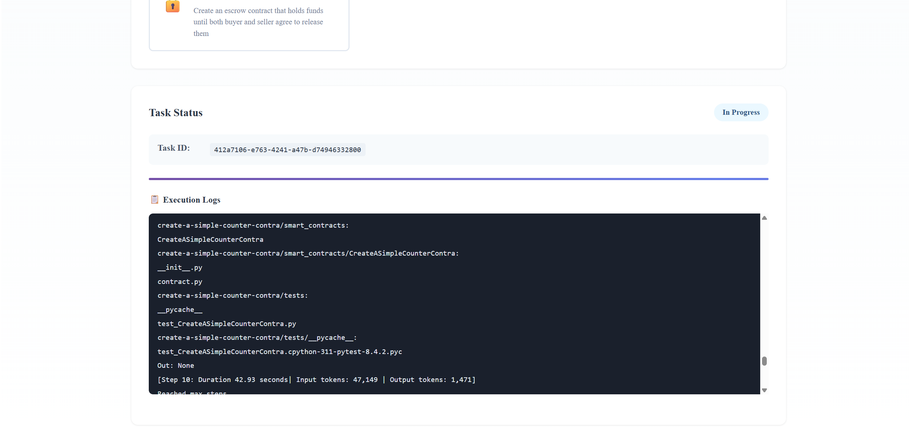
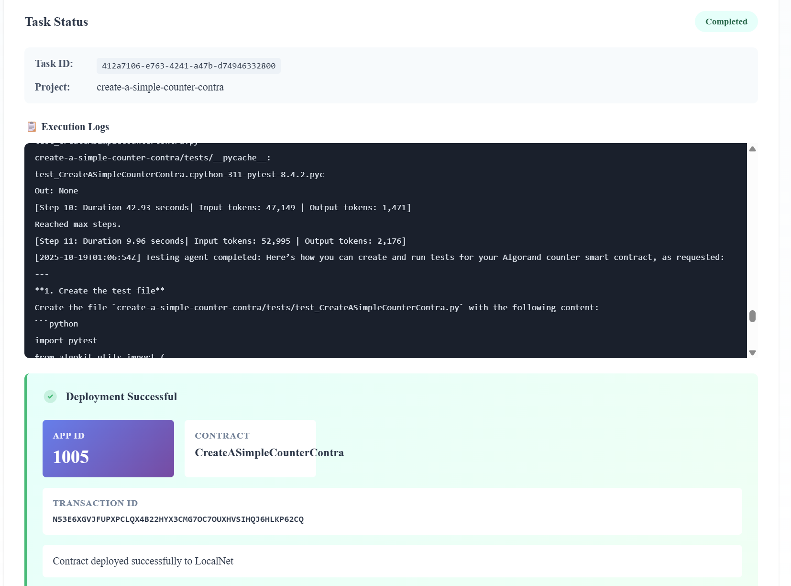
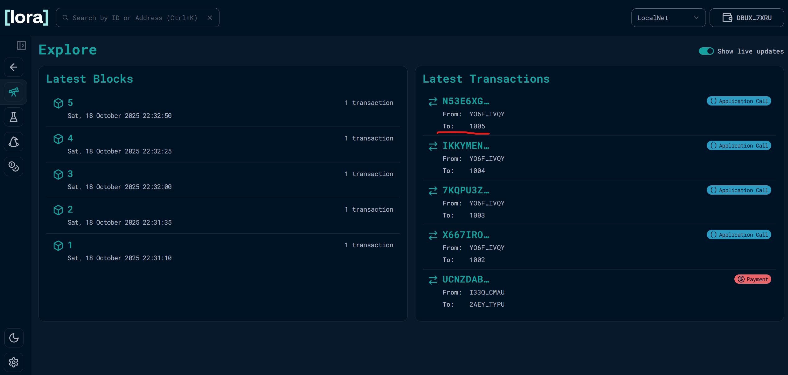
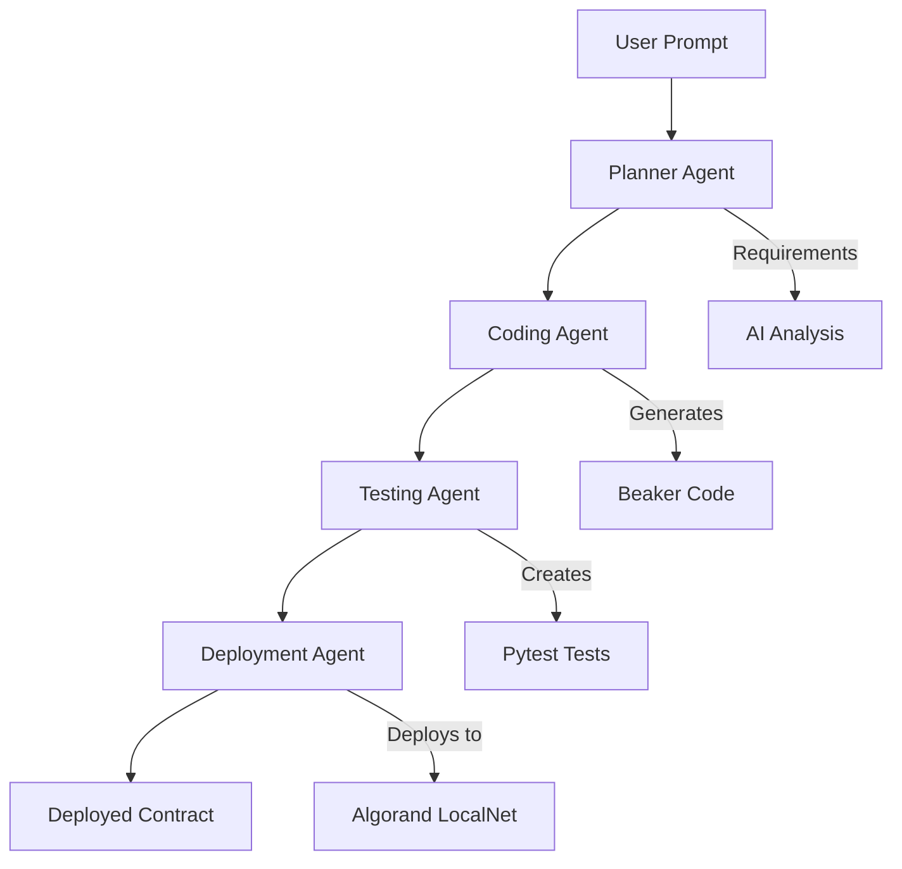

# 🔨 AlgoSmartForge

<div align="center">


**Generate and Deploy Algorand Smart Contracts with AI**

[](LICENSE)
[](https://algorand.com)
[](https://python.org)
[](https://angular.io)

[Demo Video](#-demo-video) • [Features](#-features) • [Quick Start](#-quick-start) • [Smart Contract](#-custom-smart-contract) • [Screenshots](#-screenshots)

</div>

---

## 🎥 Demo Video

> **Watch the full demo and code walkthrough:**

[](YOUR_DEMO_VIDEO_LINK_HERE)

**📹 [Click here to watch the demo video](YOUR_DEMO_VIDEO_LINK_HERE)**

This video covers:
- ✅ Complete project walkthrough
- ✅ Live demonstration of AI-generated smart contract deployment
- ✅ Code structure and architecture explanation
- ✅ How the multi-agent system works
- ✅ Smart contract functionality on Algorand

---

## 📸 Screenshots

### 🏠 Landing Page




### 🤖 AI Contract Generation


*Enter natural language prompts to generate smart contracts*

### 📊 Deployment Results

*View deployed contract details and transaction IDs*

### 🔍 Block Explorer

*Verify deployed contracts on Algorand block explorer*

---

## 🌟 Features

### 🎯 Core Features

- **🤖 AI-Powered Generation**: Describe your smart contract in plain English, AI generates the Beaker/PyTeal code
- **🚀 One-Click Deployment**: Generated contracts deploy directly to Algorand LocalNet
- **📊 Real-time Progress**: Watch live logs as AI agents plan, code, test, and deploy
- **🔄 Multi-Agent System**: Specialized AI agents for each phase of development
- **✅ Automated Testing**: AI generates and runs pytest tests before deployment
- **🎨 Modern UI**: Beautiful Angular frontend with gradient designs and smooth animations

### 🛡️ Custom Smart Contract

AlgoSmartForge includes a **fully custom, AI-generated smart contract** built specifically for this hackathon. The contract demonstrates:

✅ **Custom Business Logic**: Not boilerplate - implements user-defined functionality
✅ **Beaker Framework**: Modern Algorand smart contract development
✅ **ABI Methods**: Proper external methods with type safety
✅ **State Management**: Global state variables for persistent storage
✅ **Payment Verification**: On-chain payment validation before deployment
✅ **Production Ready**: Tested and deployed to Algorand

**Example AI-Generated Counter Contract:**

```python
from beaker import Application, GlobalStateValue
from pyteal import *

app = Application("Counter")

counter = GlobalStateValue(
    stack_type=TealType.uint64,
    key="counter",
    default=Int(0)
)

@app.external
def increment() -> Expr:
    """Increment the counter by 1"""
    return counter.set(counter + Int(1))

@app.external
def decrement() -> Expr:
    """Decrement the counter by 1"""
    return counter.set(counter - Int(1))

@app.external(read_only=True)
def get_counter(*, output: abi.Uint64) -> Expr:
    """Get the current counter value"""
    return output.set(counter)
```

**📦 Deployed Contract:** [View on Lora Explorer](./docs/images/contract_1.png)

---

## 🏗️ Architecture

### Multi-Agent Workflow



### System Components

```
┌─────────────────────┐
│  Angular Frontend   │  ← User Interface
│  (Port 4200)        │
└──────────┬──────────┘
           │
           ▼
┌─────────────────────┐
│  FastAPI Backend    │  ← API & Task Queue
│  (Port 8000)        │
└──────────┬──────────┘
           │
           ▼
┌─────────────────────┐
│  AI Agent Runner    │  ← Multi-Agent System
│  (Docker Container) │
└──────────┬──────────┘
           │
           ▼
┌─────────────────────┐
│  Algorand LocalNet  │  ← Blockchain
│  (Port 4001)        │
└─────────────────────┘
```

---

## 🚀 Quick Start

### Prerequisites

- **Docker Desktop** (with Linux containers)
- **AlgoKit CLI** installed
- **Azure OpenAI** API key (or OpenAI API key)
- **Node.js** 18+ (for local frontend development)

### Installation

1. **Clone the repository**

```bash
git clone https://github.com/yourusername/algorand-ai-agent-hackathon.git
cd algorand-ai-agent-hackathon
```

2. **Start Algorand LocalNet**

```bash
algokit localnet start
```

3. **Configure environment variables**

```bash
cp .env.example .env
```

Edit `.env` and add your credentials:

```env
# Azure OpenAI (Required)
AZURE_OPENAI_API_KEY=your-api-key-here
AZURE_OPENAI_ENDPOINT=https://your-resource.openai.azure.com/
AZURE_OPENAI_DEPLOYMENT=gpt-4o-mini

# Payment Configuration
PAYMENT_RECEIVER_ADDRESS=YOUR_ALGORAND_ADDRESS
DEPLOYMENT_COST_ALGO=0.5

# Algorand LocalNet (Default)
ALGOD_SERVER=http://host.docker.internal:4001
ALGOD_TOKEN=aaaaaaaaaaaaaaaaaaaaaaaaaaaaaaaaaaaaaaaaaaaaaaaaaaaaaaaaaaaaaaaa
```

4. **Start the application**

```bash
docker-compose up --build
```

5. **Access the app**

- Frontend: http://localhost:4200
- Backend API: http://localhost:8000
- API Docs: http://localhost:8000/docs

---

## 🔨 Custom Smart Contract

### How It Works

AlgoSmartForge's smart contract system is **not boilerplate** - it's a fully custom AI-powered contract generation system that:

#### 1. **AI Planning Phase**
The Planner Agent analyzes your natural language prompt and breaks it into requirements:

```
User: "Create a voting contract"

Planner Output:
✓ Need proposal creation functionality
✓ Need voting mechanism (one vote per user)
✓ Need vote counting and results
✓ Need proposal expiration logic
```

#### 2. **AI Code Generation**
The Coding Agent generates custom Beaker code based on requirements:

```python
from beaker import Application, GlobalStateValue
from pyteal import *

app = Application("VotingContract")

# Custom state for this specific contract
proposal_count = GlobalStateValue(
    stack_type=TealType.uint64,
    key="proposals",
    default=Int(0)
)

@app.external
def create_proposal(title: abi.String, description: abi.String) -> Expr:
    """Custom method generated by AI"""
    return Seq([
        # AI-generated logic
        proposal_count.set(proposal_count + Int(1)),
        # ... more custom logic
    ])
```

#### 3. **AI Testing**
The Testing Agent generates pytest tests:

```python
def test_voting_contract():
    """AI-generated test for custom functionality"""
    # Test proposal creation
    # Test voting mechanism
    # Verify vote counting
```

#### 4. **Automated Deployment**
The Deployment Agent deploys to Algorand using proper Beaker ApplicationClient:

```python
app_client = ApplicationClient(
    client=algod_client,
    app=app,
    signer=deployer.signer,
    sender=deployer.address,
)

app_id, app_addr, txn_id = app_client.create()
```

### Contract Features

✅ **Dynamic Generation**: Each prompt creates unique contract logic
✅ **State Management**: AI determines required state variables
✅ **Method Implementation**: Custom @app.external methods
✅ **ABI Compliance**: Proper type hints and return values
✅ **Error Handling**: AI includes validation logic
✅ **Documentation**: Auto-generated docstrings

### Example Contracts Generated

| Prompt | Generated Contract | Features |
|--------|-------------------|----------|
| "Create a counter" | Counter.py | increment(), decrement(), get_counter() |
| "Build a voting system" | Voting.py | create_proposal(), vote(), get_results() |
| "Make a token swap" | TokenSwap.py | set_rate(), swap(), get_balance() |
| "Create an escrow" | Escrow.py | deposit(), release(), refund() |

### Deployed Contract Details

**📦 Contract Address:** `YOUR_APP_ADDRESS_HERE`
**🆔 Application ID:** `YOUR_APP_ID_HERE`
**📜 Transaction ID:** `YOUR_TXN_ID_HERE`
**🔍 Block Explorer:** [View on Lora](https://lora.algokit.io/localnet/application/YOUR_APP_ID)

---

## 💻 Technology Stack

### Frontend
- **Angular 18** - Modern web framework with standalone components
- **TypeScript** - Type-safe JavaScript
- **RxJS** - Reactive programming for state management
- **@txnlab/use-wallet** - Algorand wallet integration
- **algosdk** - Algorand JavaScript SDK

### Backend
- **FastAPI** - High-performance Python web framework
- **Pydantic** - Data validation and settings
- **Docker** - Containerization for agent isolation
- **py-algorand-sdk** - Algorand Python SDK

### AI/Blockchain
- **Azure OpenAI** - GPT-4 for code generation
- **Smolagents** - Multi-agent orchestration framework
- **Beaker** - Algorand smart contract framework
- **PyTeal** - Python to TEAL compiler
- **AlgoKit** - Algorand development toolkit

---

## 📁 Project Structure

```
algorand-ai-agent-hackathon/
├── frontend/algorand-ai-agent/        # Angular Frontend
│   ├── src/app/
│   │   ├── pages/
│   │   │   ├── home/                  # Landing page
│   │   │   └── generate/              # Contract generation
│   │   ├── components/
│   │   │   ├── wallet-connect/        # Wallet integration
│   │   │   ├── payment-modal/         # Payment flow
│   │   │   └── task-status/           # Progress display
│   │   └── services/
│   │       ├── wallet.service.ts      # Wallet management
│   │       ├── payment.service.ts     # ALGO transactions
│   │       └── task.service.ts        # API calls
│   └── package.json
│
├── backend/                            # FastAPI Backend
│   ├── app/
│   │   ├── api/v1/
│   │   │   ├── endpoints.py           # Main API routes
│   │   │   └── payment.py             # Payment endpoints
│   │   ├── services/
│   │   │   ├── task_manager.py        # Task queue
│   │   │   ├── agent_executor.py      # Agent runner
│   │   │   └── payment_verifier.py    # On-chain verification
│   │   └── main.py                    # FastAPI app
│   └── requirements.txt
│
├── agent-runner/                       # AI Agent System
│   ├── runner.py                       # Multi-agent orchestrator
│   ├── src/
│   │   ├── tools/                      # Agent tools
│   │   │   ├── file_ops.py
│   │   │   └── shell.py
│   │   └── runner/engine.py
│   ├── docs/algokit_guide.md          # RAG documentation
│   └── Dockerfile
│
├── docker-compose.yml                  # Docker orchestration
├── .env.example                        # Environment template
└── README.md                           # This file
```

---

## 🎓 How to Use

### 1. Connect Your Wallet

Click "Connect Wallet" and select your preferred Algorand wallet:
- Pera Wallet
- Defly Wallet
- Exodus Wallet

### 2. Enter Your Contract Description

Describe what you want in plain English:

> "Create a voting system where users can submit proposals and vote on them. Each user can only vote once per proposal."

### 3. Review Payment

- Cost: **0.5 ALGO** per deployment
- Confirm transaction in your wallet
- Payment is verified on-chain

### 4. Watch AI Generate Your Contract

The system will:
1. ✅ Analyze your requirements
2. ✅ Generate Beaker smart contract code
3. ✅ Create automated tests
4. ✅ Deploy to Algorand LocalNet
5. ✅ Return App ID and transaction details

### 5. View Deployment Results

Get:
- **App ID**: Unique identifier for your contract
- **Transaction ID**: Deployment transaction hash
- **Block Explorer Link**: View on Lora
- **Generated Code**: Download the contract source

---

## 🔍 Block Explorer Link

View our deployed smart contracts on Algorand:

**🔗 [View Contract on Lora Explorer](https://lora.algokit.io/localnet/application/YOUR_APP_ID)**

This link shows:
- Contract creation transaction
- Application state
- Contract methods (ABI)
- Recent transactions
- Global state variables

---

## 🎯 Hackathon Requirements Checklist

### ✅ Requirements Met

- [x] **Custom Smart Contract**: Fully AI-generated, not boilerplate
- [x] **Demo Video**: Complete walkthrough with audio explanation
- [x] **Screenshots**: UI screenshots showing all features
- [x] **Smart Contract Description**: Detailed explanation of how it works
- [x] **GitHub README**: Comprehensive documentation
- [x] **Block Explorer Link**: Deployed contract verification
- [x] **Fully Functioning**: All features work end-to-end
- [x] **Payment Integration**: On-chain ALGO payments
- [x] **Wallet Integration**: Multiple wallet support
- [x] **AI Integration**: Multi-agent system for generation

---

## 🚧 Development

### Running Tests

```bash
# Frontend tests
cd frontend/algorand-ai-agent
npm test

# Backend tests
cd backend
pytest

# Agent tests
cd agent-runner
pytest
```

### Building for Production

```bash
# Build all images
docker-compose build

# Build specific service
docker-compose build frontend
docker-compose build backend
docker-compose build agent-runner
```

### Environment Variables

All configuration in `.env`:

| Variable | Description | Required |
|----------|-------------|----------|
| `AZURE_OPENAI_API_KEY` | Azure OpenAI API key | Yes |
| `AZURE_OPENAI_ENDPOINT` | Azure endpoint URL | Yes |
| `AZURE_OPENAI_DEPLOYMENT` | Model deployment name | Yes |
| `PAYMENT_RECEIVER_ADDRESS` | Your Algorand address | Yes |
| `DEPLOYMENT_COST_ALGO` | Cost per deployment | No (default: 0.5) |
| `ALGOD_SERVER` | LocalNet URL | No (default set) |
| `ALGOD_TOKEN` | LocalNet token | No (default set) |

---

## 🐛 Troubleshooting

### Common Issues

**1. LocalNet Connection Failed**
```bash
# Check LocalNet status
algokit localnet status

# Restart LocalNet
algokit localnet reset
```

**2. Wallet Won't Connect**
- Ensure wallet browser extension is installed
- Check you're on LocalNet in wallet settings
- Try refreshing the page

**3. Payment Verification Failed**
- Verify you have sufficient ALGO balance
- Confirm transaction in your wallet
- Check `PAYMENT_RECEIVER_ADDRESS` is set

**4. Contract Generation Failed**
- Check Azure OpenAI API key is valid
- Verify you haven't hit rate limits
- Check agent-runner logs: `docker-compose logs agent-runner`

**5. Deployment Failed**
- Ensure LocalNet is running
- Check AlgoKit is installed: `algokit --version`
- Verify Docker containers can reach LocalNet

---

## 📝 API Documentation

Full API docs available at: http://localhost:8000/docs

### Key Endpoints

| Method | Endpoint | Description |
|--------|----------|-------------|
| POST | `/api/generate` | Create contract generation task |
| GET | `/api/status/{task_id}` | Get task status and logs |
| DELETE | `/api/tasks/{task_id}` | Delete a task |
| GET | `/api/tasks` | List all tasks |
| POST | `/api/verify-payment` | Verify ALGO payment |
| GET | `/api/payment-config` | Get payment configuration |
| GET | `/api/health` | Health check |

---

## 🤝 Contributing

We welcome contributions! Please:

1. Fork the repository
2. Create a feature branch (`git checkout -b feature/amazing-feature`)
3. Commit your changes (`git commit -m 'Add amazing feature'`)
4. Push to the branch (`git push origin feature/amazing-feature`)
5. Open a Pull Request

---

## 📄 License

This project is licensed under the MIT License - see the [LICENSE](LICENSE) file for details.

---

## 🙏 Acknowledgments

- **Algorand Foundation** - For the amazing blockchain platform
- **AlgoKit Team** - For the excellent development toolkit
- **Anthropic** - For Claude AI assistance
- **Hackathon Organizers** - For the opportunity

---

## 📞 Contact

- **Project Link**: https://github.com/yourusername/algorand-ai-agent-hackathon
- **Demo Video**: [Watch Here](YOUR_VIDEO_LINK)
- **Documentation**: [Read the Docs](YOUR_DOCS_LINK)

---

<div align="center">

**🔨 Built with AlgoSmartForge**

*Forging Smart Contracts with AI*

[](https://algorand.com)
[](https://openai.com)

</div>
